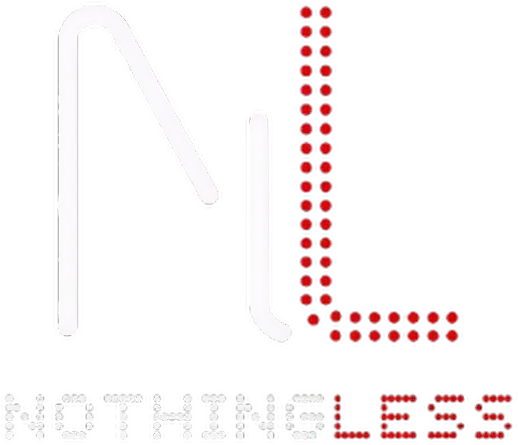

<p align="center">
  
  <br><br>
  A high-performance, deeply customizable Wayland shell built with Quickshell.
  <br><br>
  <i>Forked from <a href="https://github.com/Axenide/Ambxst">Ambxst</a> — less is more.</i>
</p>

<p align="center">
  <a href="https://github.com/Leriart/NothingLess">
    
  </a>
  <a href="https://github.com/Axenide/Ambxst">
    
  </a>
</p>

---

## Features

### Shell & Desktop

- **Unified Shell Panel** -- Single full-screen window containing the bar, notch, and dock in integrated or separate layouts
- **Dynamic Island Notch** -- StackView-based navigation hub for launcher, dashboard, notifications, and media controls
- **Multi-Monitor Support** -- Per-screen instances via `Variants` on `Quickshell.screens` for all UI layers
- **Reactive JSON Configuration** -- `FileView` watches config files on disk; `JsonAdapter` creates bidirectional QML bindings for hot config reload without restart
- **13 Color Presets** -- Ayu, Catppuccin, Everforest, GitHub, Gruvbox, Kanagawa, Nord, Nothing, Paradise, Posterpole, Rose Pine, Tokyonight, Yoru
- **Custom GLSL Shaders** -- 55+ component files with fragment shaders for gradients, halftones, and wavy backgrounds

### Compositor Integration

- **130+ Configurable Settings** -- Full Hyprland configuration exposed through the settings UI: borders, gaps, rounding, opacity, dim, snap, shadows, blur, animations, input (keyboard, mouse, touchpad), cursor, gestures, layout-specific options (Dwindle, Master, Scrolling), XWayland, VRR, and more
- **Live Preview** -- All settings apply instantly via `axctl config raw-batch` with zero restart
- **Keybind Editor** -- Interactive key capture with multi-key bindings and layout-aware actions
- **Static Source Architecture** -- `source = ~/.local/share/nothingless/hyprland.conf` is created once at install and never regenerated, matching Ambxst's approach to prevent Hyprland config reload disruption
- **Config Reload Resilience** -- Automatic bind and settings recovery when Hyprland reloads its config via `configreloaded` event detection

### Performance

- **QtMultimedia Video Wallpapers** -- Hardware-accelerated video playback for animated backgrounds (MP4, WebM, MOV, AVI, MKV) using FFmpeg
- **Configurable GPU Backend** -- Supports both OpenGL and Vulkan via `QSG_RHI_BACKEND` with threaded render loop for responsive UI
- **GPU Texture Caching** -- `GradientCache` singleton enables GPU texture sharing to reduce redundant uploads
- **NVIDIA Optimizations** -- `LIBVA_DRIVER_NAME`, `GBM_BACKEND`, and `__GLX_VENDOR_LIBRARY_NAME` environment variables for optimal video decode and rendering
- **FPS Monitoring** -- Custom MangoHud integration captures frame-present events and displays real-time FPS in the notch overlay

### Content & Productivity

- **AI Assistant** -- Multi-provider LLM support (ChatGPT, Gemini, others) with configurable strategies; integrated chat in dashboard with persistent history
- **Clipboard Manager** -- Full history with persistent storage and unified search across all content tabs
- **Notes Application** -- Persistent notes system with local storage
- **Emoji Picker** -- Searchable emoji database integrated into launcher and dashboard
- **Tmux Session Manager** -- View and manage tmux sessions from the dashboard
- **Wallpaper Manager** -- Browse, preview, and apply wallpapers with automatic color palette generation via Matugen

### Tools

- **OCR Capture (Lens)** -- Google Lens-style screenshot OCR with multi-language support (English, Spanish, Japanese, Chinese, Korean, Latin)
- **Screenshot Tool** -- Region selection with overlay preview and instant capture
- **Screen Recording** -- `gpu-screen-recorder` and `wf-recorder` integration with FPS monitoring
- **QR/Barcode Scanner** -- `zbar` integration for quick decoding
- **Color Picker** -- Interactive color selection with hex output
- **System Monitor** -- Real-time CPU, RAM, GPU, disk, and temperature metrics displayed in the notch

### System

- **PAM Authentication** -- Secure lockscreen with built-in PAM integration
- **WlSessionLock** -- Native Wayland session lock protocol support
- **Idle Management** -- Configurable idle timeouts with lock, screen off, and suspend actions
- **Power Profiles** -- `powerprofilesctl` integration for performance, balanced, and power-saver modes
- **Battery Notifications** -- Configurable low and critical battery alerts
- **Brightness Control** -- Per-monitor brightness with save/restore via CLI

---

## Installation

```bash
curl -sL https://github.com/Leriart/NothingLess/raw/main/install.sh | sh
```

Or clone manually:

```bash
git clone https://github.com/Leriart/NothingLess.git ~/.local/src/nothingless
sudo ln -s ~/.local/src/nothingless/cli.sh /usr/local/bin/nothingless
```

Then run:

```bash
nothingless
```

### Compositor integration

```bash
nothingless install hyprland     # Add NothingLess config to Hyprland
nothingless remove hyprland      # Remove NothingLess config from Hyprland
```

This creates a static sourced config at `~/.local/share/nothingless/hyprland.conf` and adds `source = ~/.local/share/nothingless/hyprland.conf` to your Hyprland config. On first boot, `exec-once = nothingless` launches the shell, which starts the axctl daemon internally. All compositor settings are managed by axctl (live via `raw-batch`, persisted via `axctl.toml`).

Supported on **Arch**, **Fedora**, and **NixOS** (requires Hyprland).

---

## Commands

### CLI

```bash
nothingless                          # Start NothingLess shell
nothingless update                   # Update NothingLess
nothingless reload                   # Reload NothingLess
nothingless quit                     # Quit NothingLess
nothingless lock                     # Activate lockscreen
nothingless run <command>            # Run a NothingLess module
nothingless brightness <0-100>       # Set brightness
nothingless brightness +/-<delta>    # Adjust brightness
nothingless brightness -s            # Save current brightness
nothingless brightness -r            # Restore saved brightness
nothingless screen on|off            # Control display power
nothingless suspend                  # Suspend system
```

### Module Commands

| `nothingless run ...` | Description |
|---|---|
| `launcher` | Open app launcher |
| `dashboard` | Open dashboard |
| `assistant` | Open AI assistant |
| `clipboard` | Open clipboard manager |
| `emoji` | Open emoji picker |
| `notes` | Open notes |
| `tmux` | Open tmux session manager |
| `wallpapers` | Open wallpaper picker |
| `overview` | Open workspace overview |
| `powermenu` | Open power menu |
| `tools` | Open tools menu |
| `config` | Open settings |
| `screenshot` | Take screenshot |
| `screenrecord` | Screen record |
| `lens` | Open OCR capture |
| `toggle-metrics` | Toggle notch metrics display |
| `lockscreen` | Lock session |

### Keybinds

| Key | Action |
|---|---|
| `SUPER` (hold) | Launcher |
| `SUPER + D` | Dashboard |
| `SUPER + A` | Assistant |
| `SUPER + V` | Clipboard |
| `SUPER + PERIOD` | Emoji picker |
| `SUPER + N` | Notes |
| `SUPER + T` | Tmux |
| `SUPER + COMMA` | Wallpapers |
| `SUPER + TAB` | Workspace overview |
| `SUPER + ESC` | Power menu |
| `SUPER + S` | Tools menu |
| `SUPER + SHIFT + C` | Settings |
| `SUPER + SHIFT + S` | Screenshot |
| `SUPER + SHIFT + R` | Screen record |
| `SUPER + SHIFT + A` | Lens |
| `SUPER + L` | Lock session |
| `SUPER + SHIFT + BACKSPACE` | Toggle metrics overlay |

---

## FPS Monitoring (`nothing-fps`)

NothingLess includes a modified MangoHud that captures FPS data and displays it in the notch metrics overlay.

```bash
# Launch a game with FPS monitoring
nothing-fps ./my-game

# Steam launch options (right-click game > Properties > Launch Options)
nothing-fps %command%
```

**How it works:**

1. `nothing-fps` sets up a modified MangoHud (`libMangoHud_shim.so`) via `LD_PRELOAD`
2. MangoHud hooks Vulkan/OpenGL to capture frame-present events
3. Calculated FPS is written to `/dev/shm/nothingless_fps`
4. NothingLess reads this file in real-time and displays FPS in the notch

**Rebuilding MangoHud from source:**

```bash
./scripts/mangohud-patch/build-mangohud.sh
```

Requires: `meson`, `ninja`, `gcc`, `glslang`, `python-mako`.

---

## Differences from Ambxst

### Architecture

| Area | Ambxst | NothingLess |
|------|--------|-------------|
| Compositor settings | ~40 options (border, shadow, blur) | 130+ options across 11 categories |
| Config reload handling | Basic | `configreloaded` event detection with instant bind/settings recovery |

### Performance

| Area | Ambxst | NothingLess |
|------|--------|-------------|
| Video wallpaper | mpv-based | QtMultimedia + FFmpeg (hardware-accelerated, lower overhead) |
| Rendering backend | Default | Configurable: OpenGL (default) or Vulkan with threaded render loop |
| GPU optimization | Standard | NVIDIA env vars, GPU texture caching (`GradientCache`) |
| GLSL shaders | Original set | Optimized (reduced draw calls, shared GPU textures) |
| FPS monitoring | Not available | Custom MangoHud integration with real-time notch display |


### Design

| Area | Ambxst | NothingLess |
|------|--------|-------------|
| Typography | Roboto, varied | Ndot (dot-matrix), monospace-first |
| Color scheme | Vibrant themes | Monochrome with subtle red accents |
| Animations | Heavy, ornate | Minimal, functional |
| Branding | Color glyphs | Red + white dot-matrix |

---

## Credits

- **Leriart** -- fork maintainer and NothingLess developer
- **Axenide** -- original [Ambxst](https://github.com/Axenide/Ambxst) creator
- **outfoxxed** -- creator of [Quickshell](https://git.outfoxxed.me/outfoxxed/quickshell)
- **end-4** -- inspiration from [dots-hyprland](https://github.com/end-4/dots-hyprland)
- **DankMaterialShell** -- design reference from [DMS](https://github.com/AvengeMedia/DankMaterialShell)
- **Noctalia** -- reference from [noctalia-shell](https://github.com/noctalia-dev/noctalia-shell)

---

## License

- NothingLess modifications are provided under the same license as the upstream.
- Ambxst and the Ambxst logo are trademarks of Adriano Tisera (Axenide).
- See [LICENSE](./LICENSE) and [TRADEMARK.md](./assets/nothingless/TRADEMARK.md) for details.

