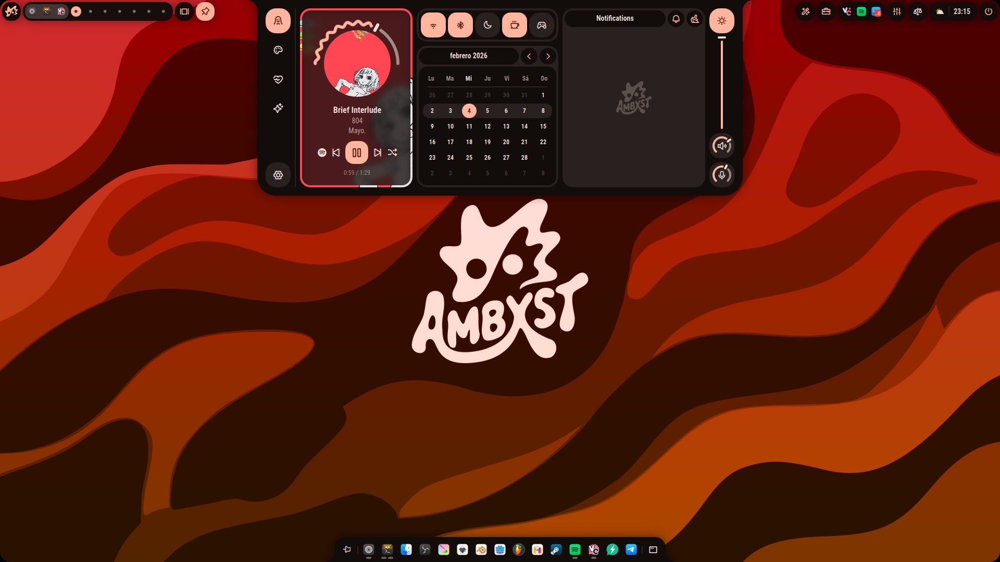
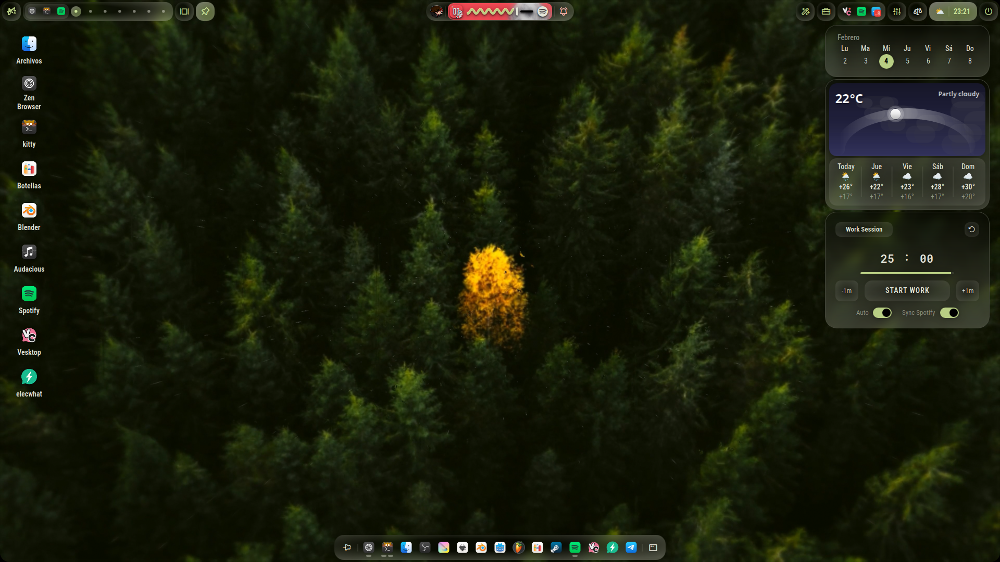
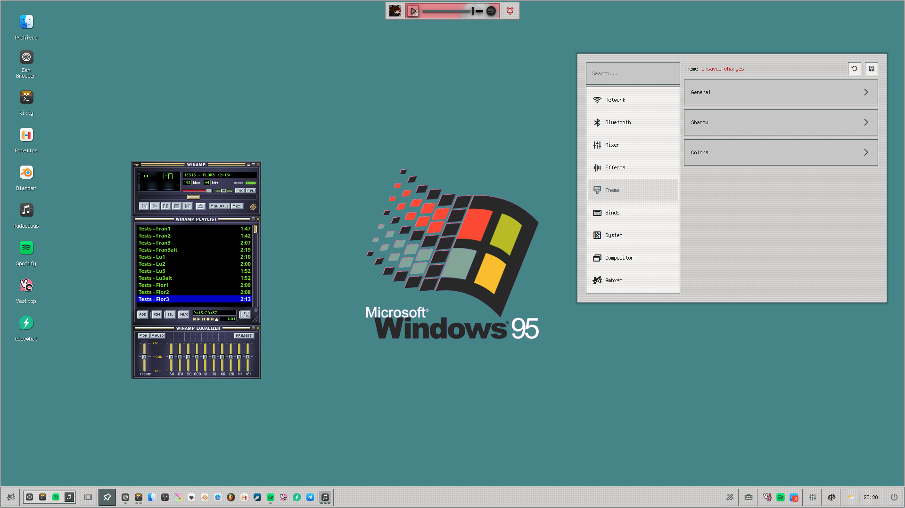
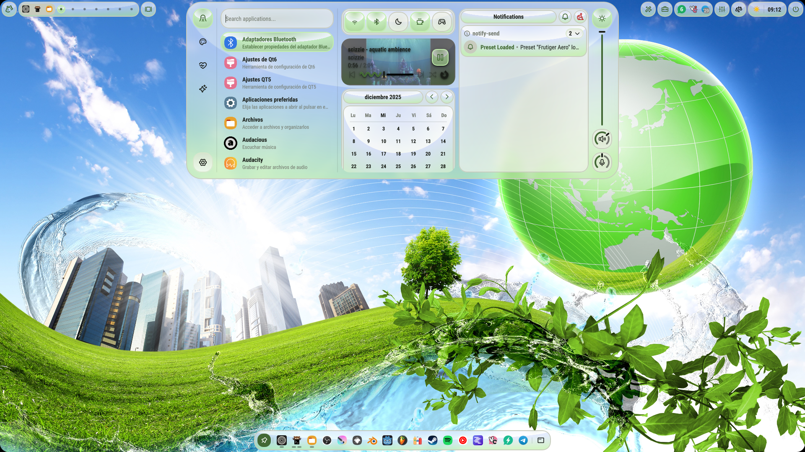
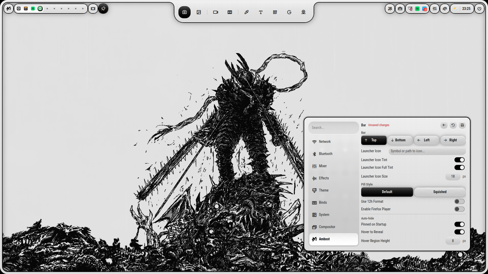
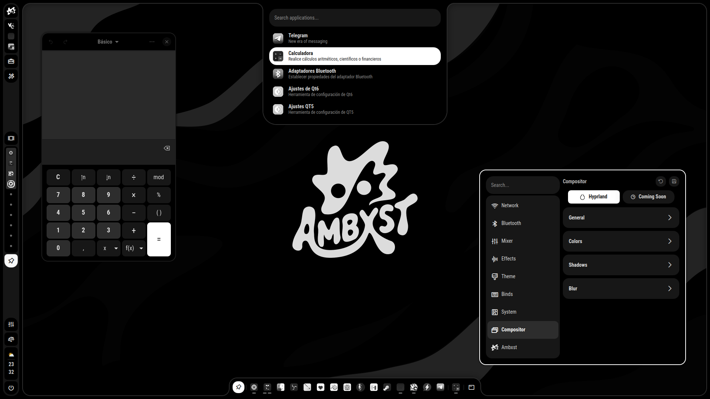
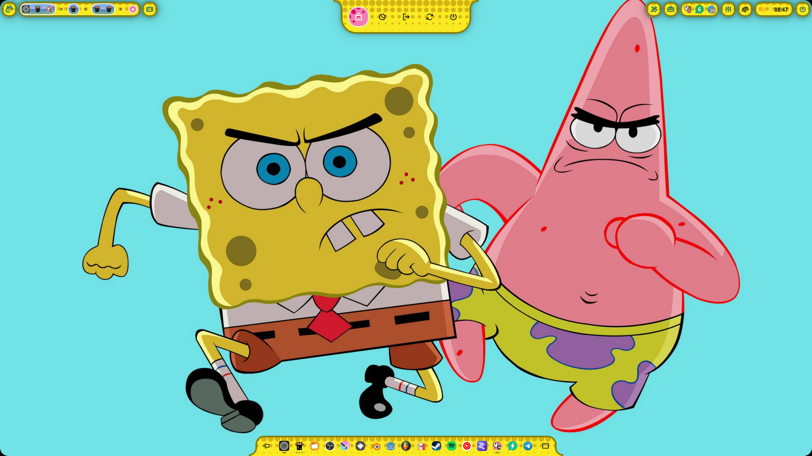
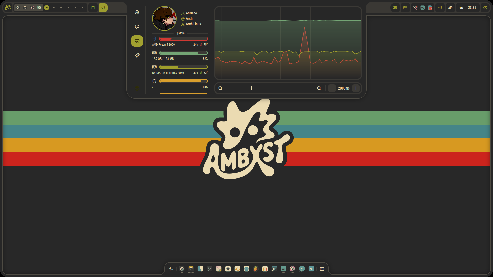
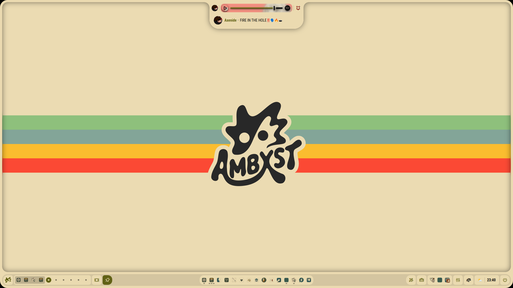
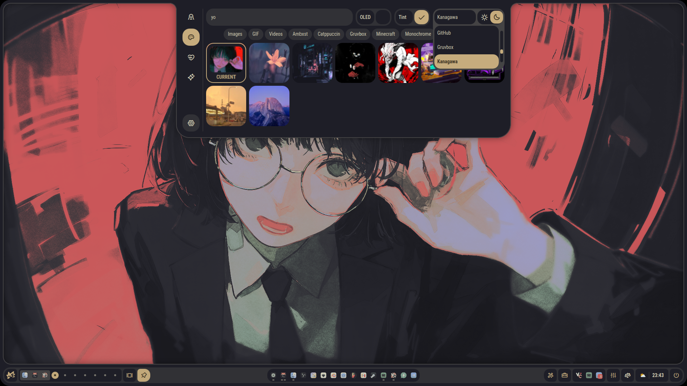

<p align="center">

  <br>
  <br>
A <b>minimal</b> &amp; <b>performant</b> fork of <a href="https://github.com/Leriart/Ambxst">Ambxst</a>.
<br><br>
<i>Inspired by the Nothing Phone — less is more.</i>
</p>

  <p align="center">
  <a href="https://github.com/Th3LastGamer9/NothingLess/stargazers">
    
  </a>
</p>

---

## ⚡ The Concept

**NothingLess** is a fork of Ambxst that strips away the bloat and doubles down on what matters: **speed, responsiveness, and a clean aesthetic**.

Just like the Nothing Phone line, the philosophy here is:

> **What you don't see is as important as what you do.**

- ❌ No unnecessary animations
- ❌ No heavy dependencies
- ❌ No visual clutter
- ✅ Lightweight components
- ✅ Minimal resource usage
- ✅ Clean, monochrome-first design language

---

<h2><sub></sub> Screenshots</h2>

<div align="center">
  

  <br />

  
  
  

  
  
  

  
  
  
</div>

---

<h2><sub></sub> Installation</h2>

*Coming soon — for now, follow the Ambxst installation instructions below:*

```bash
curl -L github.com/Leriart/NothingLess/nothingless | sh
```

### Hyprland

1. Run the installation command above.

2. Run `nothingless install hyprland` to add Ambxst's configuration to Hyprland:

```lua
-- Ambxst
loadfile(os.getenv("HOME") .. "/.local/share/nothingless/hyprland.lua")()
```

3. Start Ambxst by running `nothingless` in your terminal.

Supported on **Arch**, **Fedora**, and **NixOS**.

> [!IMPORTANT]
> The only pre-requisite is having Hyprland installed.

---

<h2><sub></sub> NothingLess Differences</h2>

| Feature | Ambxst | NothingLess |
|---------|--------|-------------|
| Animations | Heavy, ornate | Minimal, functional |
| Color scheme | Vibrant themes | Monochrome / subtle accents |
| Logo | Color (red + gradient) | Dot-matrix red & white |
| Performance target | Feature-rich | Lightweight & fast |
| Presets | Many themes | Performance-optimized defaults |
| Dot-matrix aesthetic | ❌ | ✅ Nothing Phone inspired |

---

## Credits

- **NothingLess** is a **fork** of [Ambxst](https://github.com/Leriart/Ambxst) by [Leriart](https://github.com/Leriart) — all original credit goes to them and the contributors listed below.
- [outfoxxed](https://outfoxxed.me/) for creating Quickshell and great documentation!
- [end-4](https://github.com/end-4) for his awesome projects. I learned a lot from them! (And *yoinked* a lot of code, too. 😅)
- [soramane](https://github.com/soramanew) for helping me when I started with Quickshell.
- [tr1x_em](https://trix.is-a.dev/) for being a great friend and helping me find great tools. You rock!
- [Darsh](https://github.com/its-darsh) for not killing me when I left Fabric. u_u (Also for being a great friend and creating Fabric! Without Fabric, Ax-Shell wouldn't exist, so Ambxst wouldn't either. Thank you!)
- [Mario](https://github.com/mariokhz) for being a great friend and showing me Quickshell!
- [Samouly](https://samouly.is-a.dev/) for being Samouly. :3
- [Brys](https://github.com/brys0) for being his continuous support and for being a great friend!
- [Zen](https://github.com/wer-zen) for being a great friend and helping me when I started with Quickshell too!
- [kh](https://www.youtube.com/watch?v=dQw4w9WgXcQ) for being an awesome human being and listening to my delusions about Ambxst. :D
- And you, the user, for trying out NothingLess! You're awesome! 💖
