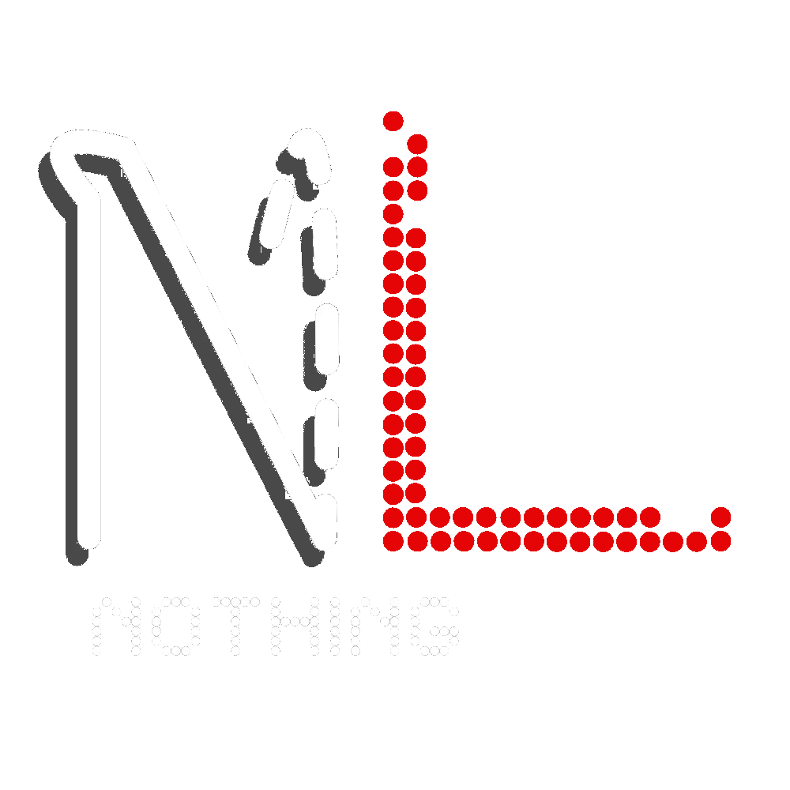
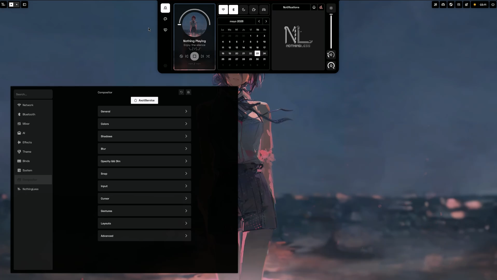
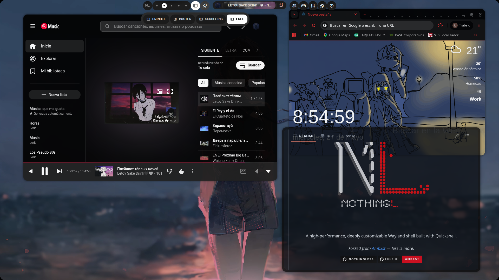
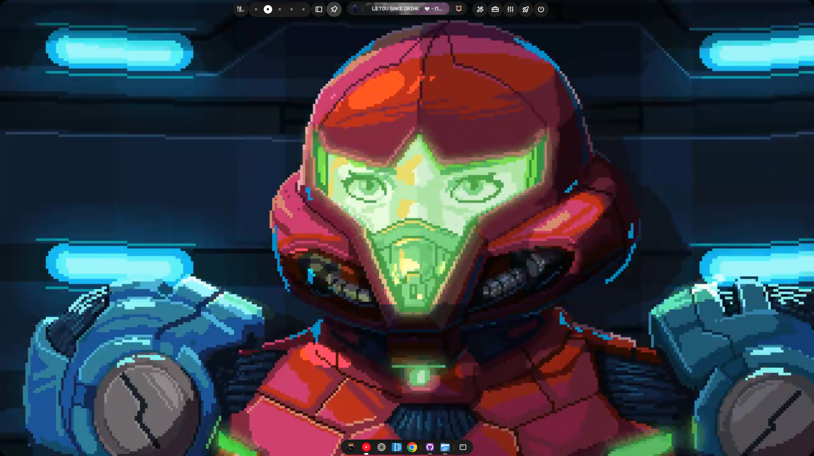
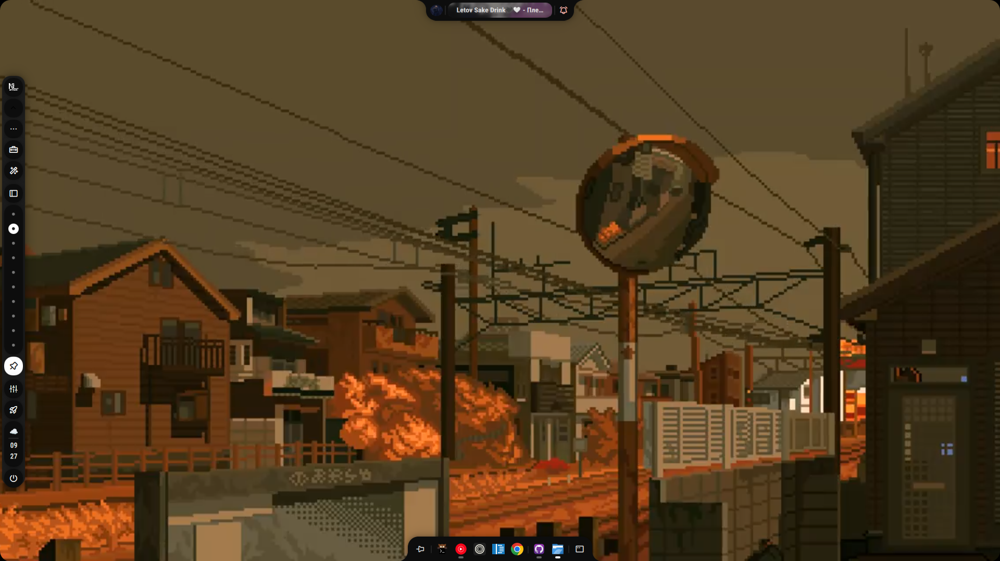
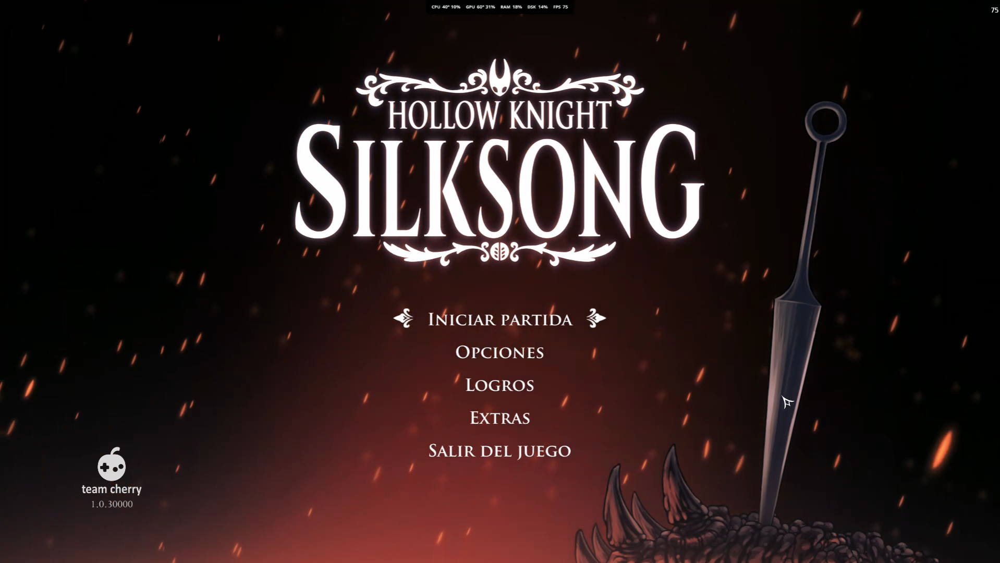

<p align="center">
  
  <br><br>
  A high-performance, deeply customizable Wayland shell built with Quickshell.
  <br><br>
  <i>Less is more.</i>
</p>

<p align="center">
  <a href="https://github.com/Leriart/NothingLess">
    
  </a>
  <a href="https://discord.gg/ehQYYW36Up">
    
  </a>
  <a href="https://github.com/leriart/axctl.c">
    
  </a>
  <a href="https://github.com/Axenide/Ambxst">
    
  </a>
</p>

---

## Screenshots

<p align="center">
  
  &nbsp;&nbsp;
  
  &nbsp;&nbsp;
  
  <br><br>
  
  &nbsp;&nbsp;
  
</p>

---

## Installation

```bash
curl -sL https://github.com/Leriart/NothingLess/raw/main/install.sh | sh
```

Or clone manually:

```bash
git clone https://github.com/Leriart/NothingLess.git ~/.local/src/nothingless
sudo ln -s ~/.local/src/nothingless/cli.sh /usr/local/bin/nothingless
sudo ln -s ~/.local/src/nothingless/scripts/nothing-fps /usr/local/bin/nothing-fps
sudo ln -s ~/.local/src/nothingless/scripts/nothingless-resize /usr/local/bin/nothingless-resize
nothingless
```

### Compositor integration

```bash
nothingless install hyprland           # Auto-detect
nothingless install hyprland --conf    # Force config file mode (default)
nothingless install hyprland --lua     # Force Lua mode (Hyprland >= 0.48)
nothingless remove hyprland            # Remove config
```

On first boot, `exec-once = nothingless` launches the shell, which starts the axctl daemon internally. All compositor settings are managed live via axctl and persisted to `~/.local/share/nothingless/`.

---

## Features

- **Free Layout** — Windows-like floating desktop with edge snap
- **Dynamic Island** — unified notch + bar with integrated notifications, metrics, and launcher
- **Task Tray** — system tray with per-icon show/hide
- **Overview** — Mission Control-style workspace manager with drag & drop and live preview
- **Dashboard** — visual config panel with 200+ toggleable options
- **FPS Monitoring** — real-time FPS overlay in the notch via patched MangoHud + built-in `libambfps.so`
- **Monitor Configuration** — GUI panel and CLI backend for per-monitor settings
- **Snap Assistant** — intelligent window snapping via axctl
- **M3 Animations** — Material You, Windows Classic, and macOS animation profiles via `Anim.qml`
- **12 Presets** — Dot Matrix, Nothing, Pure Monochrome, Minimal, GNOME, Liquid Glass, and more
- **Hardware-Accelerated Wallpapers** — video wallpapers via QtMultimedia + FFmpeg
- **AI Assistant Sidebar** — multi-provider chat (OpenAI, Gemini, Anthropic, Mistral, Groq, Ollama, DeepSeek, MiniMax) with tool calling and agent support
- **Compositor Sync** — 100+ Hyprland settings live-applied from NothingLess config GUI
- **Game Mode** — snapshot/restore compositor (gaps, blur, shadows, animations) + pause video wallpaper + suppress notifications, toggled by keybind or `nothingless run gamemode`
- **Focus Mode** — zero gaps + DND + caffeine, snapshot/restore on toggle
- **Power Profile** — `power-profiles-daemon` integration with cycle, auto-switch to power-saver on low battery (configurable threshold)
- **Charge Limit** — battery charge limit via TLP (sudo) or direct sysfs (auto-detected); persists across reboots

---

## FPS Monitoring

NothingLess includes two FPS backends that write to `/dev/shm/nothingless_fps`, displayed in real time in the notch metrics overlay.

### nothing-fps (recommended)

Uses a patched MangoHud + `libambfps.so` fallback. Works with Vulkan and OpenGL games.

```bash
# Terminal
nothing-fps ./my-game
nothing-fps --visible vkcube          # show FPS overlay too

# Steam — launch options for any game
nothing-fps %command%

# Lutris / Heroic / Bottles
nothing-fps <game command>
```

Enable the notch metrics display:
```bash
nothingless run toggle-metrics
```

Or set `showMetrics: true` in `~/.config/nothingless/config/notch.json`.

**How it works:**
```
nothing-fps %command%
  → LD_PRELOAD=libMangoHud_shim.so:libambfps.so
  → MANGOHUD_CONFIG=fps_only,background_alpha=0,...  (invisible overlay, shm output)
  → game runs → FPS written to /dev/shm/nothingless_fps
  → SystemResources.fpsWatcher reads via tail -F
  → Notch displays real-time FPS
```

### ambfps-launcher (lightweight alternative)

Uses only `libambfps.so` (no MangoHud dependency). Lighter weight but Vulkan-only.

```bash
ambfps-launcher ./my-game
ambfps-launcher %command%             # Steam
```

---

## Commands

```bash
nothingless                            # Start the shell
nothingless reload                     # Reload the shell
nothingless quit                       # Quit the shell
nothingless lock                       # Activate lockscreen
nothingless update                     # Update NothingLess
nothingless run <module>               # Run a module (launcher, dashboard, overview, etc.)
nothingless run toggle-metrics         # Toggle FPS/CPU/GPU metrics in notch
nothingless run gamemode               # Toggle game mode
nothingless run focusmode              # Toggle focus mode
nothingless run caffeine               # Toggle caffeine (idle inhibit)
nothingless run dnd                    # Toggle do-not-disturb
nothingless profile <saver|balanced|performance>  # Set power profile
nothingless cycle-profile              # Cycle to next power profile
nothingless charge-limit [on|off|50-100]           # Battery charge limit
nothingless brightness <0-100>         # Set brightness
nothingless screen on|off              # Display power control
nothingless suspend                    # Suspend system
nothingless install hyprland [--lua]   # Install compositor integration
nothingless remove hyprland            # Remove compositor integration
```

**Standalone companion commands:**
```bash
nothing-fps [--visible] <command>      # Launch game with FPS monitoring
nothing-fps --help                     # Show FPS launcher help
nothingless-resize                     # Window resizing tool
```

---

## Testing

```bash
# Test FPS pipeline (3 terminals)
# Terminal 1 — watch shared memory
watch -n0.5 cat /dev/shm/nothingless_fps

# Terminal 2 — launch vkcube with FPS monitoring
nothing-fps vkcube

# Terminal 3 — verify libraries loaded
cat /proc/$(pidof vkcube)/maps | grep -E "libMangoHud|libambfps"
```

Expected output in Terminal 1:
```
fps=1440.5
pid=12345
frames=1234
source=mangohud
```

If you see `source=nothingless-preload`, the `libambfps.so` fallback is active (Vulkan hooks). If you see nothing, ensure:
- Libraries exist at `~/.local/lib/libMangoHud_shim.so` and `~/.local/lib/libambfps.so`
- Notch metrics are enabled (`nothingless run toggle-metrics`)
- Rebuild patched MangoHud: `./scripts/mangohud-patch/build-mangohud.sh`

---

## Differences from Ambxst

| Area | Ambxst | NothingLess |
|------|--------|-------------|
| Compositor settings | ~25 options | **~100+ options** (4x more) |
| Layouts | Dwindle, Master, Scrolling | **+ Free Layout** (floating desktop) |
| Services | 30 | **39** (+9 new) |
| Scripts | 22 | **38** (+16 new) |
| Config reload handling | None | `configreloaded` detection with instant recovery |
| Dynamic Island | Not available | Unified notch + bar in island mode |
| Task tray | Not available | System tray with icon show/hide |
| Animations | `animDuration` global | **Anim.qml** — M3, Windows Classic, macOS profiles |
| Video wallpaper | mpv-based | **QtMultimedia + FFmpeg** (hardware-accelerated) |
| Bar mode | Static bar | **Extended/dynamic modes** with per-monitor config |
| Monitor configuration | Manual (hyprctl) | **GUI panel + CLI** in NothingLess |
| FPS overlay | Not available | **Patched MangoHud + libambfps.so** with notch display |
| FPS launcher | Not available | **nothing-fps** wrapper for Steam/Lutris/terminal |
| Axctl daemon | Basic | **Health check, auto-reconnect, restart on failure** |
| Config sync with hyprland | None | **hyprland.conf/lua generated** from binds.json |
| CLI commands | 9 | **20+** commands |
| Presets | 8 | **12** (+Dot Matrix, Nothing, Pure Monochrome, Minimal) |
| Typography | Roboto | **Ndot** (dot-matrix), monospace-first |
| Color scheme | Vibrant | **Monochrome** with red accents |
| AI Assistant | Not available | **Multi-provider chat sidebar** (8 backends) |
| Click-outside dismiss | Not available | **Focus-change detection** + compositor-driven window focus |

---

## Credits

- **Leriart** — fork maintainer and NothingLess developer
- **Axenide** — original [Ambxst](https://github.com/Axenide/Ambxst) creator
- **Zack** ([@zackytodearena](https://bsky.app/profile/zackytodearena.bsky.social)) — logo & animation design
- **outfoxxed** — creator of [Quickshell](https://git.outfoxxed.me/outfoxxed/quickshell)

---

## License

- NothingLess modifications are provided under the same license as the upstream.
- Ambxst and the Ambxst logo are trademarks of Adriano Tisera (Axenide).
- See [LICENSE](./LICENSE) and [TRADEMARK.md](./assets/nothingless/TRADEMARK.md) for details.
